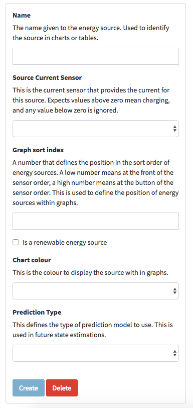

# About Energy Sources in Kauri
A feature of Kauri is that it allows you to identify the amount of energy from each of your energy sources. This makes for better predictions of the future state of your system and provides more information to help maintain and expand your system.

## Parameters for an energy source

When you setup your "Data Processing" options you have the option of configuring an energy source (as above). This is how you tell Kauri how you generate energy so that it can de-aggregate your generation data for more useful graphing.

The following information is required:

* Name of the energy source (e.g.: "Wind").
* Source Current Sensor. See below in 'Current sources' for more information about these options.
* Graph sort index. This is just used to position the energy source as you'd like on graphs.
* "Is a renewable energy source". This is used to determine where the energy source should be displayed in the "Daily Energy Sources" graph which seperates renewable and non-renewable sources for better visibility of environmental impact.
* "Chart colour". Choose from several preset colours for the energy source's display in graphs.
* "Prediction Type". See below in 'Determining a prediction pattern' for more information.
	
## Current sources
Kauri needs to be able to identify the current of your energy source.

If you have a sensor that specifically measures the current generated by one of your energy sources, great! 
However, if you don't, there are two special virtual sensors that Kauri can use to identify the current from your energy source.

These are:

* "Charger (when load current is positive)". As the name suggests, this is determined from the load current sensor. Use this if have an inverter/charger, typically for a generator. When the load current goes positive it is determined to be charging. In order to account for the full energy output of the generator, the output of the energy source is the sum of the chargers output to the battery and the power used by the building (as it is assumed the building is powered off the generator whilst the inverter/charger is in charging mode).

* "Other (remaining energy generation)". Use this if you have one energy source which doesn't have a specific sensor on it. The system will consider all un-accounted for energy as part of this energy source.

## Determining a prediction pattern
Kauri applies a prediction pattern to your energy sources in order to predict the future state of the system.

**[For more information on the supported prediction patterns and how future states work, see the future state page.](future-state.md)**