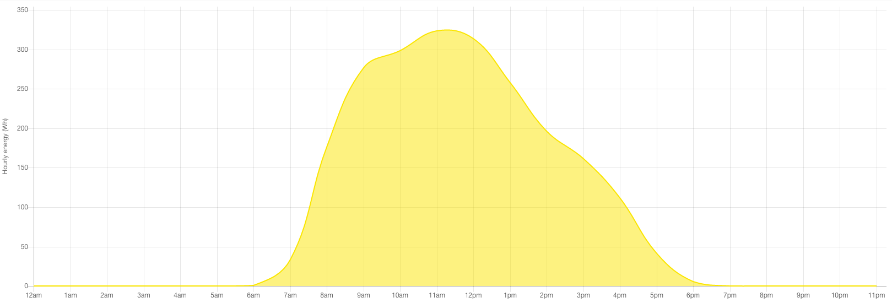
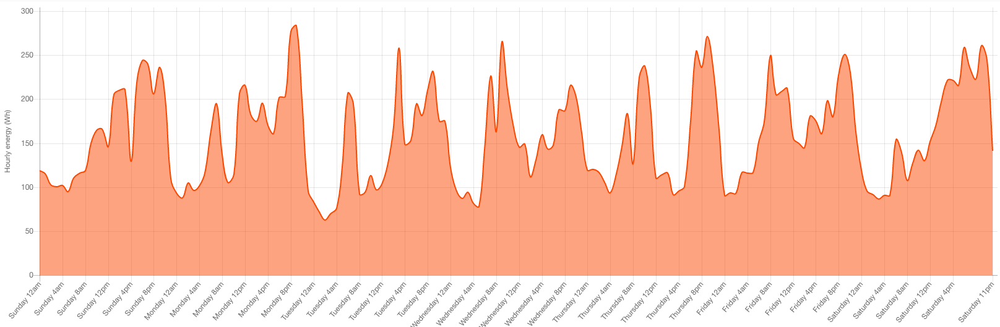
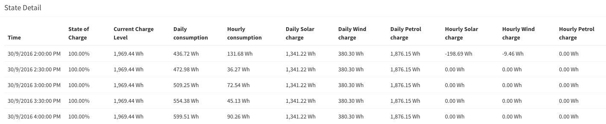

# How Kauri works with future state

## What is a prediction pattern?
When setting up an energy source, Kauri asks for the type of prediction pattern to use. The section below can help you determine which prediction pattern to use.

The prediction type determines the method that Kauri will use to determine the future generation of an energy source. You'll want to consider this carefully as the accuracy of the prediction pattern helps produce an overall prediction of the future state of the entire system.

## Types of energy source prediction patterns

### None
The none prediction type is used to predict consumption/generation sources that have no consistent pattern so are assumed to have no energy flow in the future. This is appropriate for generators as these are directly controlled by the user and as such, are unpredictable.

### Hourly
The hourly prediction type is used to predict the energy flow of consumption/generation sources that can change within a few hours, for example, the energy generation from a wind turbine. The prediction is calculated using an exponential average of previous hours, meaning more recent hours have a greater impact on the prediction. This pattern assumes the current prediction continues for every hour in the future.

### Daily
The daily prediction type is used to predict the energy flow of consumption/generation sources that occur the same every day. This uses a rolling average with a window of 14 days to determine the pattern. This is used with energy sources like solar panels, allowing predictions to adjust with the seasons. A table and graph of the daily prediction patterns are shown on the Prediction Patterns page in the frontend.

### Weekly
The weekly prediction type is for trends that occur the same every week but not necessarily every day. The primary use case for this is a house’s consumption, as this varies within a day (e.g.: higher consumption in the evening) but also on different days of the week (e.g.: weekends might consume more than weekdays). This uses a rolling average with a window of three weeks. This allows the prediction to adjust as the building occupants routines change but also allow for minor exceptions in routine. A table and graph of the weekly prediction patterns are shown on the Prediction Patterns page in the frontend.

## About prediction multipliers
While the energy flow pattern can be identified, the magnitude of the actual totals may vary. An example is that the solar panel output would follow a similar pattern every day but some days may have above or below average generation.

Prediction multipliers are calculated for the house consumption and each energy source. This is equal to the actual energy flow in the hour, divided by the original prediction for the hour. 

This is the value the previous prediction would need to be multiplied by to get the actual energy flow. The system uses this multiplier with the prediction of future hours for a more accurate estimate. To prevent the prediction multiplier from having a significant effect in extreme cases, the multiplier is capped between 0.5x and 1.5x.

## How future state calculations work
The approach to calculating the future state is to apply the predicted generation and consumption over the next 24 hour period and determine the state of the battery at each point. The future state is re-calculated after every half hour of readings, allowing the estimate of the next battery event to be more granular. The hourly predictions are assumed to be a constant energy flow throughout the hour, so are halved for use with the half-hourly states. If the energy into the battery pushes it beyond 100% SoC, the amount of energy in from each energy source is reduced to represent generation that is wasted.

As the future states are processed, the system checks if the battery level drops below 10% or above 90% for empty or fully charged events respectively. If an event is found, its type and timestamp are recorded as part of the current state of the system. Event checking stops after one event is discovered. The Summary page shows the details of the next event, for example, “Empty in 2 hours”.

FutureState’s are objects which represent the state of the system at some time in the future. These consist of a timestamp, charge level and hourly/daily totals for consumption and each energy source. These are cleared and re-added every time the future state is calculated. The Future States page on the frontend shows a graph of the future state of charge, energy flows, and a table of FutureStates.

