# Getting started

**Ensure you've followed the steps in [setting up](setting-up.md) before working through these steps.**

## Logging in and serting up your profile
1. Login with the default login as below:

  **Username:** default@example.com 
  **Password:** changeme

2. Click "Default Person" in the top right corner, "Edit Profile" and change your email address and password.

## Setting up a bridge
In order to send readings to Kauri we need to setup a building, a bridge and sensor.

1. Click "Buildings" on the left hand menu.
<a href="resources/blank-main-screen.png?raw=true">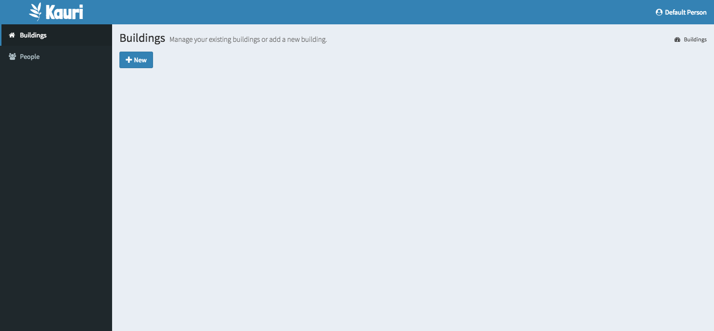</a>

2. Click "New" to add a new building. Fill in the name and change the axis defaults if you wish.
<a href="resources/add-building.png?raw=true">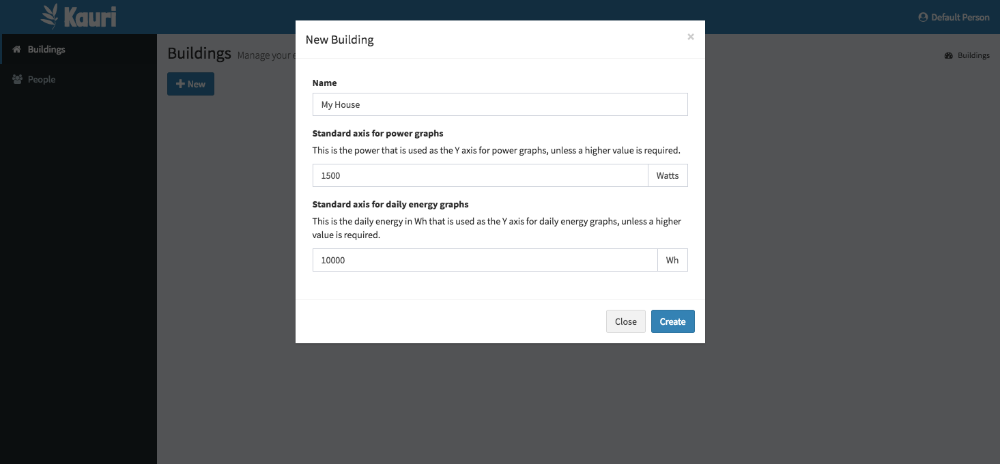</a>

3. After creating the building, it will show up on the left hand menu. Click "Configuration".

4. Click "Add Bridge", giving your bridge a name.
<a href="resources/adding-bridge.png?raw=true">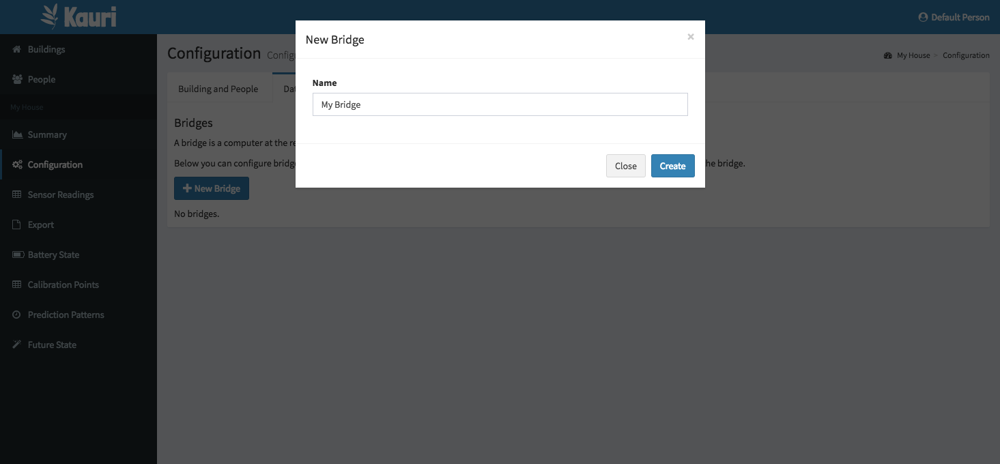</a>

5. You will now have a bridge ID and secret. These will go in your bridge configuration.
<a href="resources/bridge-added.png?raw=true">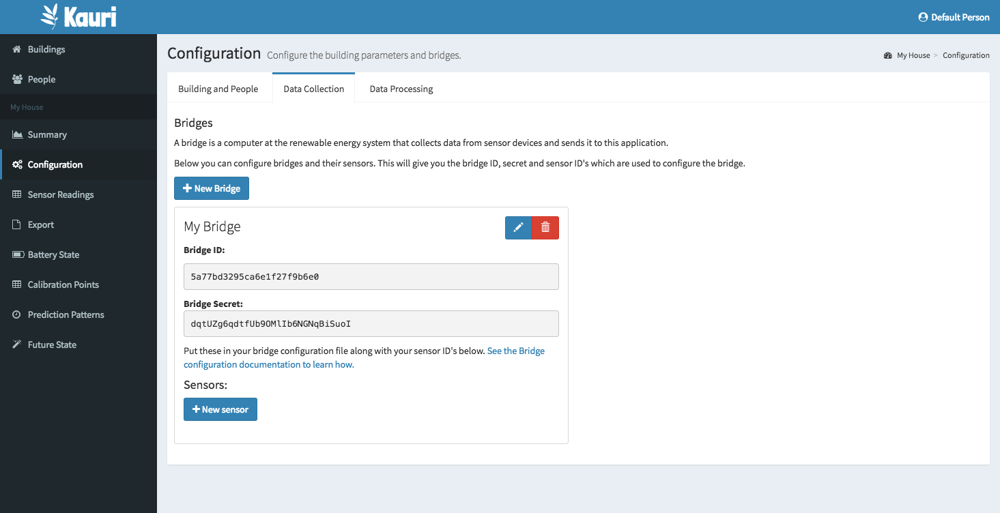</a>

**[Don't have real devices for readings just yet? You can use the fake bridge to populate from an example dataset.](using-fakebridge.md)**

## Setting up sensors

1. Click "New Sensor" and set the name and type of the sensor. The type of the sensor is used to ensure the correct unit it used when sensor values are displayed.
<a href="resources/adding-sensor.png?raw=true">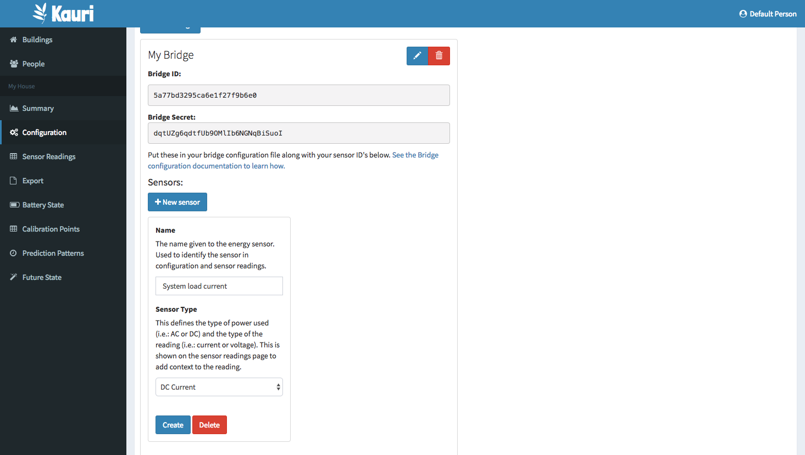</a>

2. Click "Create" on the sensor. It will now have a sensor ID which will go in your bridge configuration. Enter sensors for all reading points in your system.
<a href="resources/with-sensors.png?raw=true">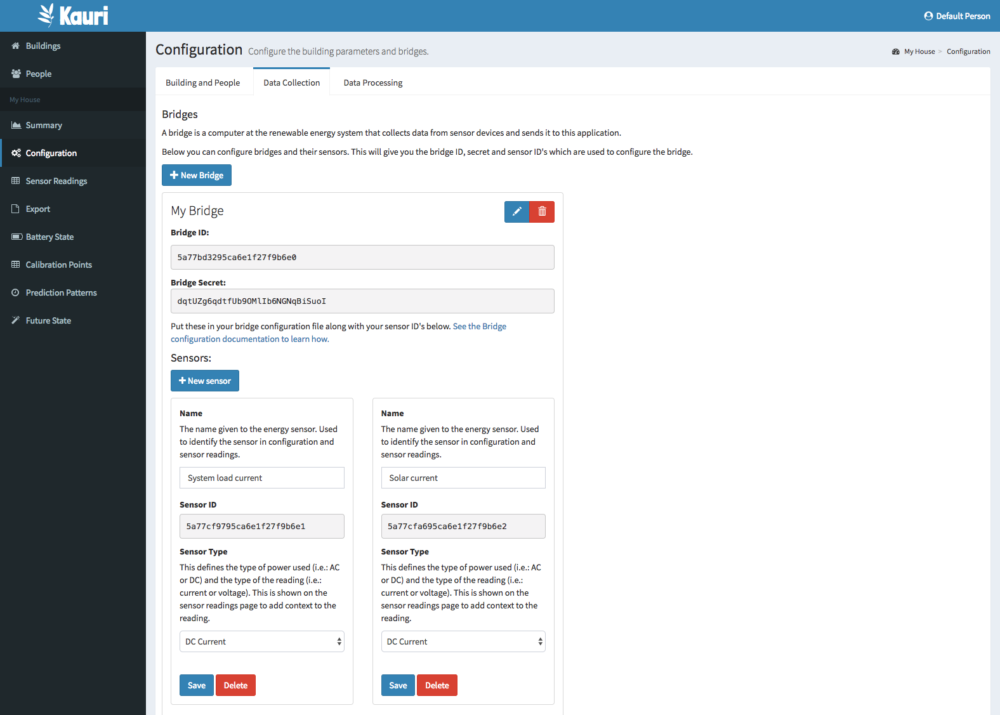</a>

## Getting readings from the bridge

**[Don't have real devices for readings just yet? You can use the fake bridge to populate from an example dataset.](using-fakebridge.md)**

1. Follow the [Bridge's documentation to setup a bridge client](https://github.com/jordancrawfordnz/kauri-bridge#configuration) and configure it with your bridge ID, secret and sensor ID's for all your devices.

2. Start the bridge reading from your devices.

3. You should see readings in "Sensor Readings" on the left hand menu.
<a href="resources/with-sensor-data.png?raw=true">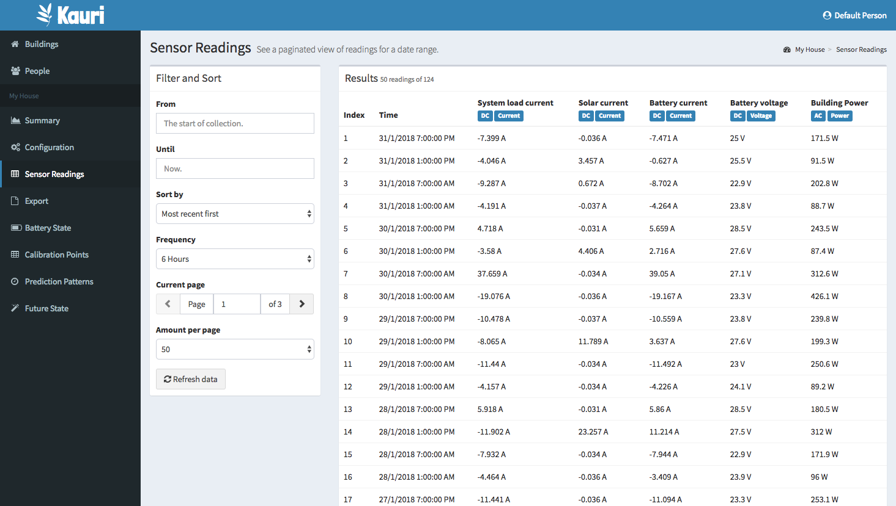</a>

### Exporting readings
You can export your readings to a CSV file. This allows you to do your own data analysis or take backups of the data you've collected.

<a href="resources/export-page.png?raw=true">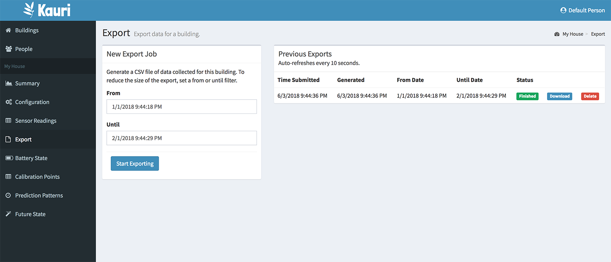</a>

## Processing readings
Now that we've got some reading data in the system it's time to setup data processing. Data processing allows the system to determine the battery state and make predictions about the future state of the system.

**[If using the `offgrid_1week_10secintervals` dataset, get your configuration values from here.](https://github.com/jordancrawfordnz/kauri-bridge/tree/master/test/datasets/offgrid_1week_10secintervals#recommended-configuration)**

1. Click "Configuration" then the "Data Processing" tab for the building.
<a href="resources/blank-data-processing-page.png?raw=true">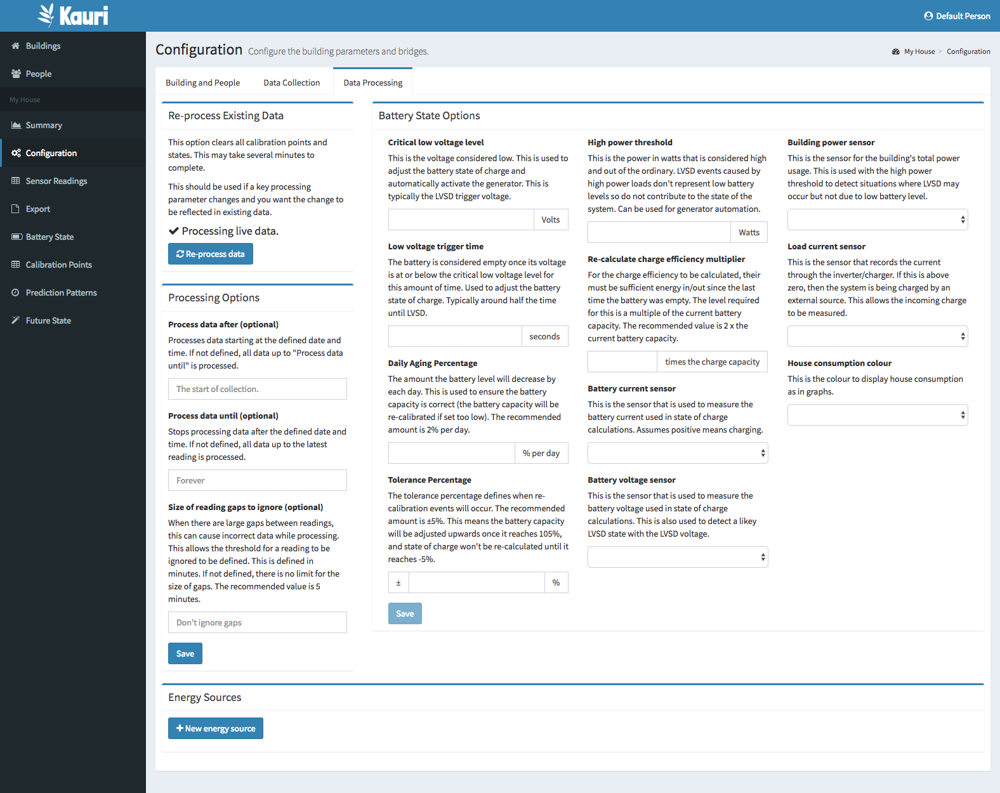</a>

2. Under "Battery State Options" enter all required fields. Read the descriptions of these fields for an indication of what these values should be for your system. This will be enough to get basic battery state information.

3. If you have dedicated sensors for your energy sources you can define what these are under "Energy Sources". Find out more about how energy sources work (and the parameters these require) in [the energy sources](energy-sources.md) documentation.

3. New data will start processing, but if wish to re-process your existing data, hit "Re-process data" to re-process all your readings.

**[To understand how the battery state page means you might want to read about the B42SOC algorithm used by Kauri](about-b42soc.md)**

### Viewing battery state
<a href="resources/battery-state.png?raw=true">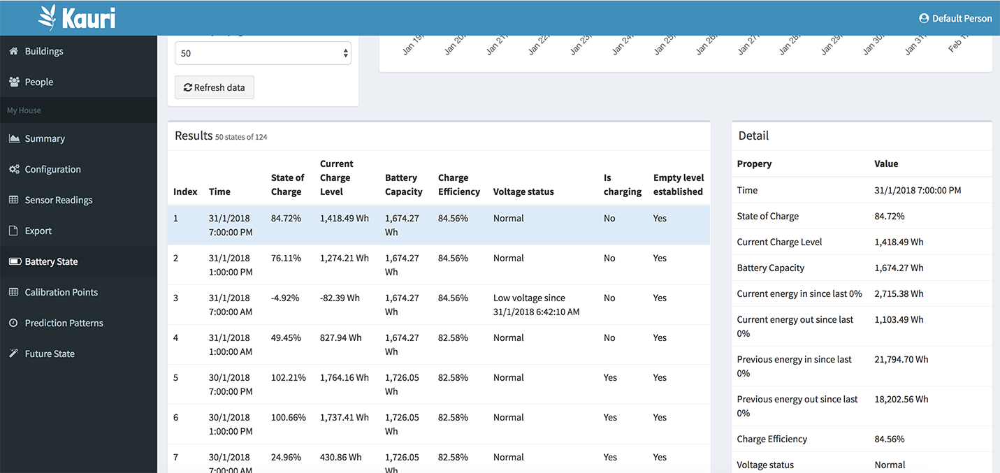</a>

The "Battery State" page shows a snapshot of the state of the system throughout time. This includes the battery state of charge, battery capacity and other outputs of the B42SOC algorithm.

This page also contains three graphs:

#### State of charge
<a href="resources/soc-graph.png?raw=true">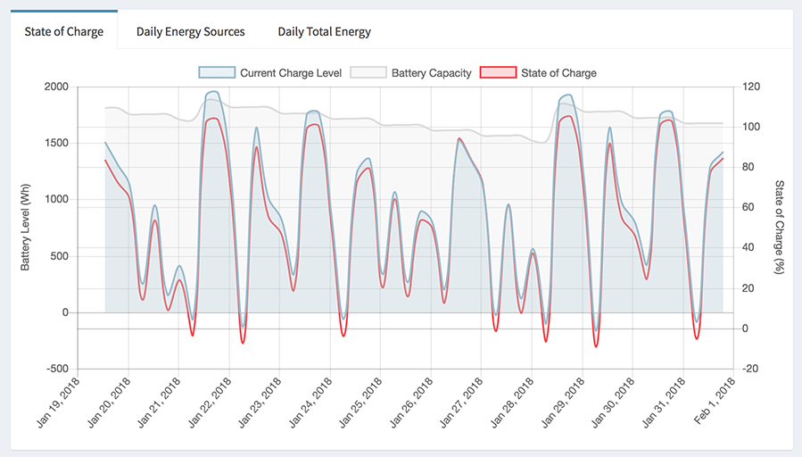</a>

This shows the current charge level and charge capacity. This gives you insight into how the algorithm adjusts the charge capacity. This also graphs the state of charge of the battery over time.

#### Daily Energy Sources
<a href="resources/daily-energy-sources-graph.png?raw=true">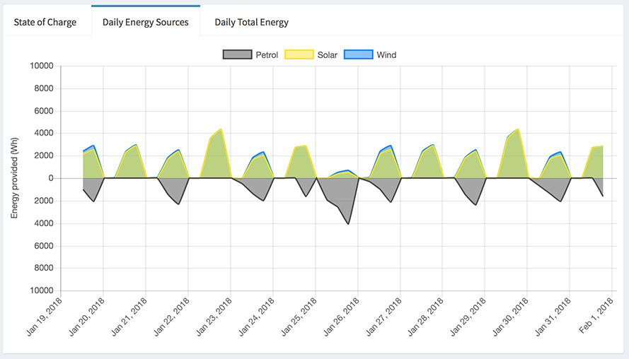</a>

This graph shows a days energy generation. This seperates renewable sources from non-renewable energy sources.

#### Daily Total Energy
<a href="resources/daily-total-energy-graph.png?raw=true">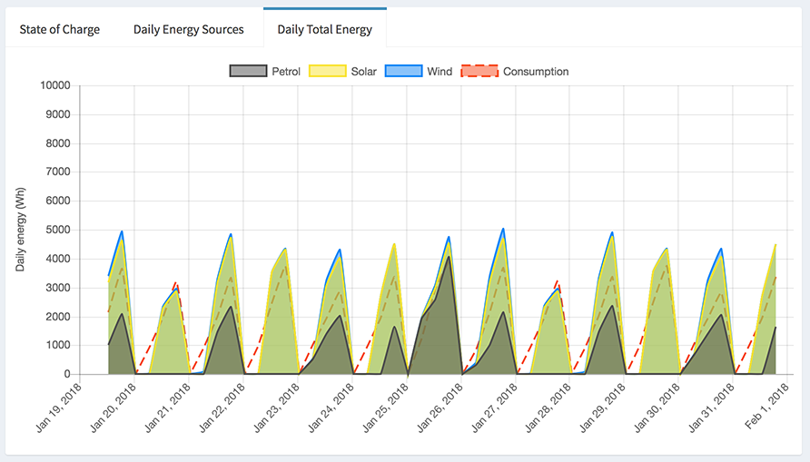</a>

This graph shows a whole days energy generation and consumption. This should give an indication of how the amount you generate compares with the amount you consume.

### Viewing calibration points
<a href="resources/calibration-points.png?raw=true">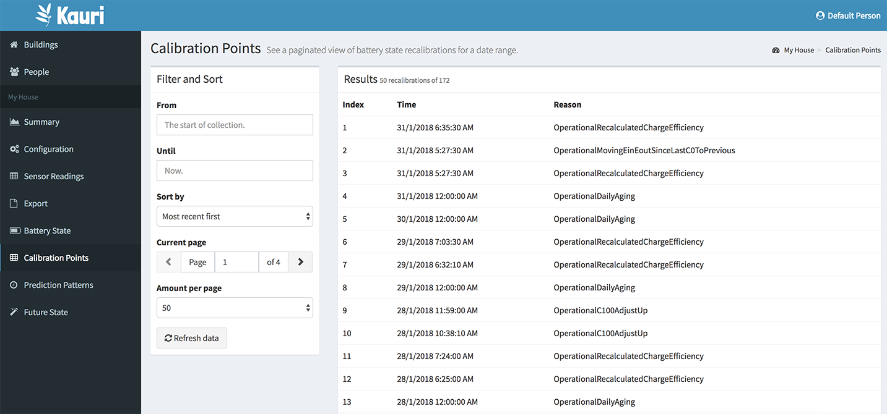</a>

The "Calibration Points" page shows all B42SOC calibration points. This is useful if you want to diagnose problems with your processing configuration or when making tweaks to the B42SOC algorithm implementation.

## Looking into the future
If you've configured energy sources, when your incoming data (or historic data re-processed) the system will start to figure out more information about your usage trends.

This will start to show on the "Summary" page for a building, the "Prediction Patterns" page and the "Future State" page.

### Viewing prediction patterns
<a href="resources/prediction-patterns.png?raw=true">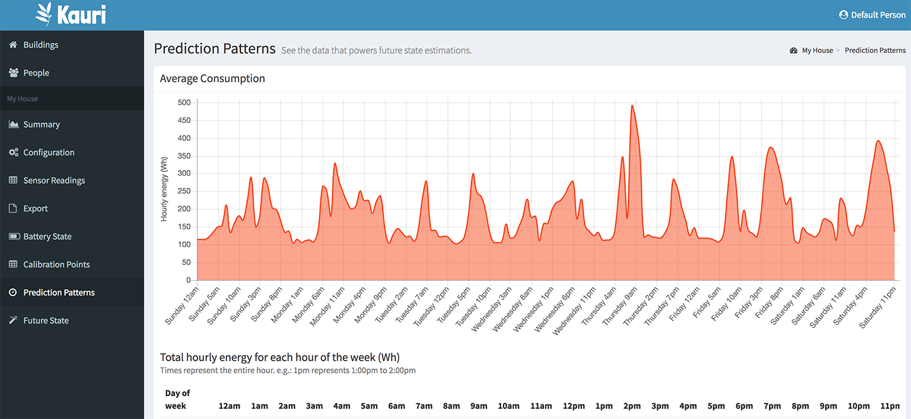</a>

The "Prediction Patterns" page shows the prediction patterns for all your energy sources. This is interesting if you want to see trends on how you use and generate energy. This may also be useful to figure out if you've chosen the correct prediction pattern for your energy source.

[For more information on the types of prediction patterns see the future state page](future-state.md)

### Viewing future state
<a href="resources/future-state.png?raw=true">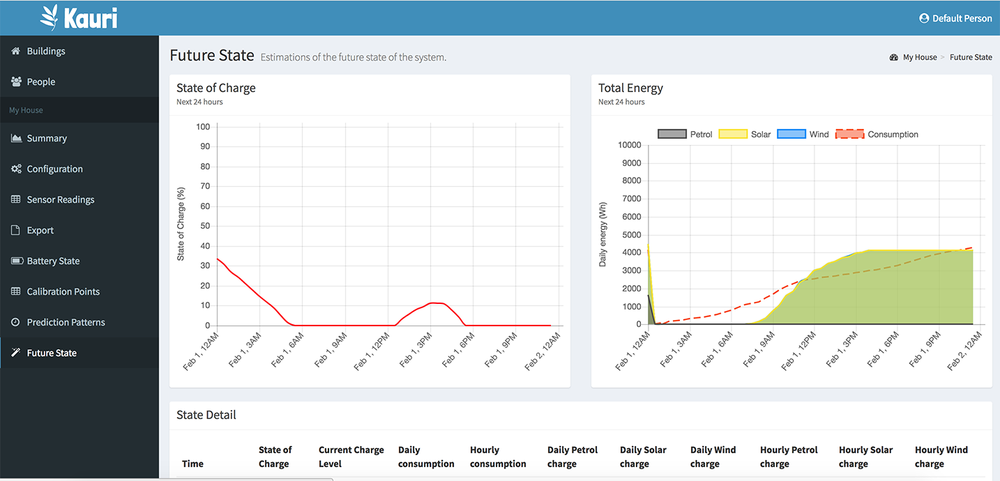</a>

The "Future State" page is much like "Battery State" but this shows the predicted future state of the system using your prediction patterns and the current state.

[For more information on how future states are determined, see the future state page](future-state.md)

## Viewing a summary of your system
You've now configured your entire system, awesome!

Many of the screens shown above are really useful for when you want to drill into the detail about how your system works. However, on a regular day-to-day basis you may find the "Summary" page more useful.

This provides a quick summary of the essential information about the state of your system.

<a href="resources/summary-page.png?raw=true">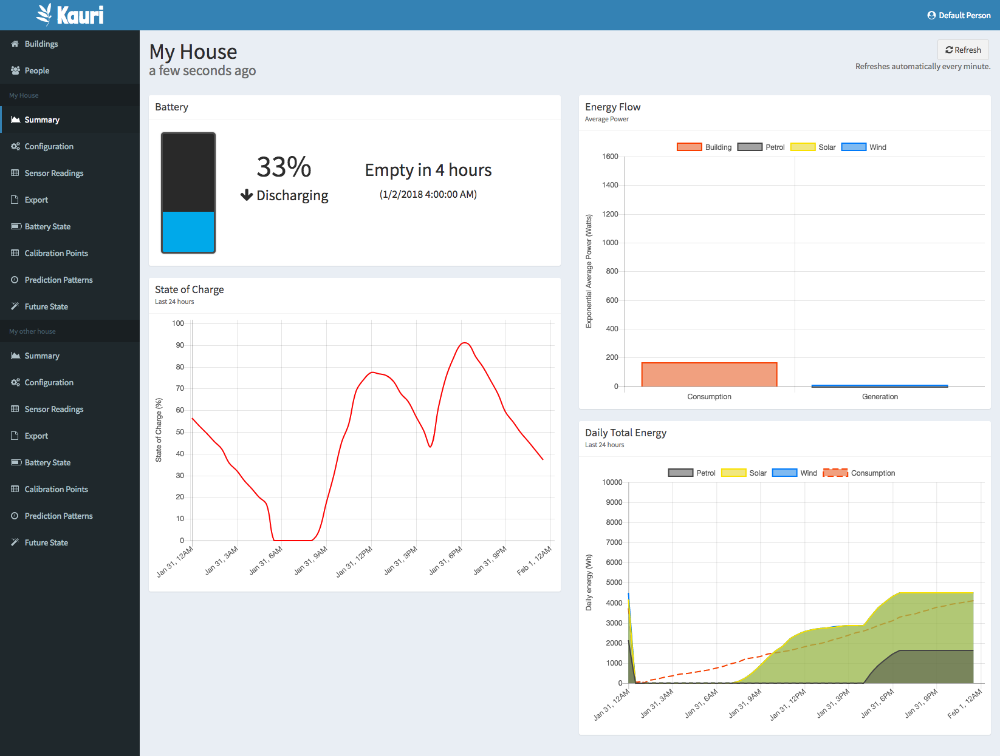</a>

The building page also shows the battery state of all your buildings:

<a href="resources/buildings-page-with-two-buildings.png?raw=true">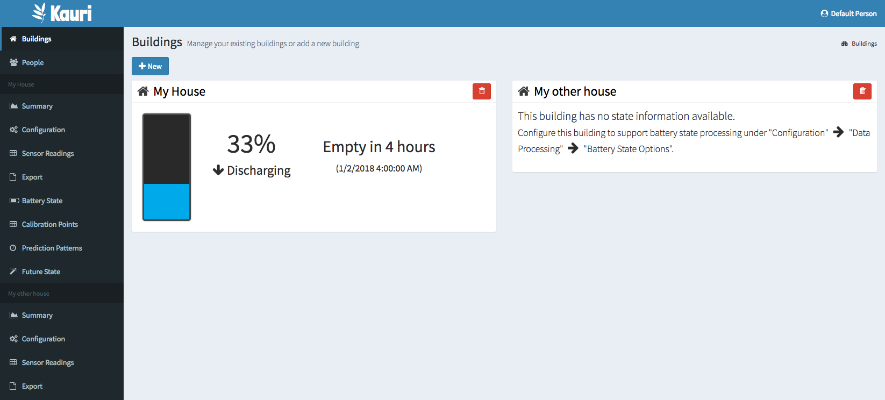</a>
