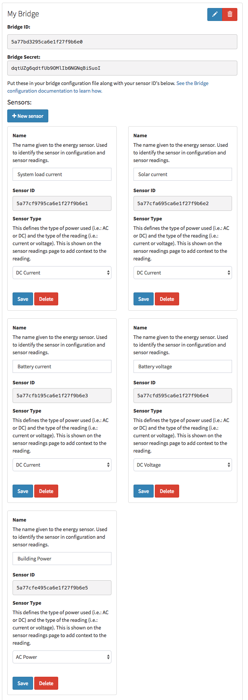

# Using the fake bridge to populate Kauri with readings
**Ensure you've followed the steps in [setting up](setting-up.md) and [setup a bridge](getting-started.md#setting-up-a-bridge) before working through these steps.**

**This guide assumes you're running your server in the default development environment.**

If you don't have a real sensor device to use yet, we can use the fake bridge to populate Kauri with an example dataset in order to experiment with it's feature set.

## Setting up sensors
We’ll be backfilling data with the [`offgrid_1week_10secondintervals` dataset](https://github.com/jordancrawfordnz/kauri-bridge/tree/master/test/datasets/offgrid_1week_10secintervals) file on a loop. This dataset contains columns for several sensors [which you'll need to setup as explained here](https://github.com/jordancrawfordnz/kauri-bridge/tree/master/test/datasets/offgrid_1week_10secintervals#sensor-devices).

Follow the [getting started guide's section on setting up sensors](getting-started.md#setting-up-sensors) but with the sensors required for the dataset.

Your sensors should look something like below:

## Setting up Kauri Bridge
Kauri Bridge is used to read data from sensors and send it to Kauri at regular intervals. In addition to working for live data sending, Kauri Bridge also has a fake bridge that can back fill a set of data from one of it’s fake sensors.

Clone the [Kauri Bridge](https://github.com/jordancrawfordnz/kauri-bridge) repo and follow [these instructions](https://github.com/jordancrawfordnz/kauri-bridge#running-the-bridge) to setup Kauri bridge on your system.

## Building a fake bridge configuration file
The dataset comes with an example configuration at the [`test/datasets/offgrid_1week_10secintervals/config_example.json` path](https://github.com/jordancrawfordnz/kauri-bridge/tree/master/test/datasets/offgrid_1week_10secintervals/config_example.json) for the fake bridge.

Make a copy of this (I've called mine `bulk_upload.json` in the root directory of `kauri-bridge`) and fill in your bridge ID, secret and sensor IDs. Set the `fillFrom` and `fillUntil` range to the dates you want to populate readings for. Starting with 1 month is recommended.

[Your file should end up looking something like this](resources/filled_in_fakebridge_config.json) (but with your own IDs and bridge secret).

## Running fake bridge
Run `node startfakebridge.js bulk_upload.json`.

It'll start hitting the Kauri API to fill it with data and output what time it's currently up to every now and then. After this is done you should have some data when you click `Sensor Readings`.

**[Now that you've got data you can continue with processing readings from the getting started guide](getting-started.md#processing-readings)**
