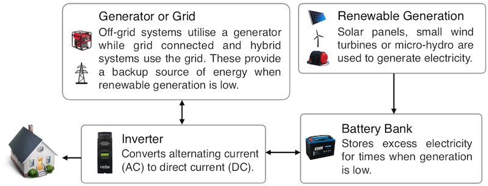

# What do I need?
Kauri has a few moving parts. Here's all the things you need to be able to use Kauri.

### An energy system
An obvious requirement is that you'll need an energy system to monitor! Kauri was specifically designed with off-grid systems in mind but will work fine for almost any configuration of home energy system depending on what features you require.

**This diagram shows the basic components of an off-grid energy system:**

### Sensors
You'll need to have some sensors that we can get data from. The sensors that you need depend on the level of information you require.

[Kauri Bridge](https://github.com/jordancrawfordnz/kauri-bridge) will need to support your sensor devices. **See [the devices page on the bridge project](https://github.com/jordancrawfordnz/kauri-bridge/tree/master/devices) for information about support.** If Kauri Bridge doesn't support your device yet you can always implement support yourself by working through [the implementation guide](https://github.com/jordancrawfordnz/kauri-bridge/tree/master/devices#implementing-your-own-device).

To determine the **state of charge** of the battery, Kauri requires:

* A battery current sensor.
* A battery voltage sensor.
* A building power sensor.
* A load current sensor.

To determine **energy flows** in the system, Kauri requires:

* A building power sensor.
* A load current sensor.
* A current sensor for each energy source you wish to track.

If you don't have a sensor for all energy sources, Kauri can assign the remaining energy generation to one of your energy sources. In addition, the load current sensor can be used to determine generation from the charger. **See [energy sources](docs/energy-sources.md) for more details about this.**.

To calculate the **future state of your system**, Kauri needs to be able to calculate the state of charge of the battery and get energy flow information.

### A 'bridge' computer
To collect data from your sensor devices you'll need a computer on-site that can act as the bridge between your sensors and the cloud. This must be capable of running [Kauri Bridge](https://github.com/jordancrawfordnz/kauri-bridge) and will need to be able to communicate with your sensors.

Your bridge computer also requires an internet connection in order to communicate with Kauri running on the cloud.

A small computer such as an [Intense PC](http://www.fit-pc.com/web/products/intense-pc/) is a good option for this, or possibly something even smaller like a [Raspberry Pi](https://www.raspberrypi.org/) would work.

### Server accessable by the internet
Finally, you'll need access to a server that you can access from anywhere on the internet. This is where Kauri's data will be stored and where your bridge will send it's data to.

A Linux cloud server like those from [DigitalOcean](http://digitalocean.com/), [Vultr](https://www.vultr.com/) or [AWS](https://aws.amazon.com/) work great.